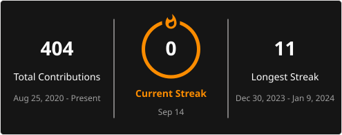

# 💫 About Me

Hi, I’m **Md. Raju Mia** 👋

I’m a passionate **Android Developer** with hands-on experience building scalable, real-world mobile applications using **Java, Kotlin, and Flutter**.

I enjoy turning complex business requirements into clean, maintainable, and high-performance applications.

Currently working as an **Associate Software Engineer at Nexkraft Limited**, where I develop and maintain production-level Android applications using **MVP and MVVM architecture**.

---

## 🌐 Socials

---

## 🧑‍💻 What I Do

- 📱 Build production-ready Android applications
- 🏗️ Develop applications using **MVP & MVVM architecture**
- 🔄 Integrate **REST APIs** and real-time data synchronization
- 💾 Implement offline data storage using **Room Database**
- 🔥 Work with **Firebase & FCM** for authentication, notifications, and cloud services
- 🗺️ Integrate **Google Maps APIs** and location-based features
- 🔧 Maintain and improve existing production applications
- 🐛 Debug issues, optimize performance, and reduce application crashes
- 🌿 Follow Git-based development workflows with GitHub and Bitbucket

---

## 💻 Tech Stack

### 📱 Android Development

### 🏗️ Architecture & Libraries

### ☁️ Backend & Services

### 🛠️ Tools & Workflow

---

## 🚀 Featured Projects

### 📱 BRAC Fleet App
**Android • Java • MVP • REST API • Google Maps**

A fleet management application developed for real-world vehicle operations, including features such as auto allocation and fleet-related workflows.

### 🔧 BRAC Mechanics App
**Android • Kotlin • MVVM • Koin • Firebase**

A production-level application designed to support mechanics with operational workflows and real-time notifications.

### 🚗 BRAC Fleet Driver App
**Android • Java • MVP • Room • Offline Sync**

A driver-focused fleet application with modules including **Leave, Reconciliation, Attendance Record**, and offline trip data management.

---

## 📊 GitHub Stats

---

## 👾 Pac-Man Contribution Graph

<picture>
  <source
    media="(prefers-color-scheme: dark)"
    srcset="https://raw.githubusercontent.com/Md-Raju-Mia/Md-Raju-Mia/output/pacman-contribution-graph-dark.svg"
  />
  <source
    media="(prefers-color-scheme: light)"
    srcset="https://raw.githubusercontent.com/Md-Raju-Mia/Md-Raju-Mia/output/pacman-contribution-graph.svg"
  />
  
</picture>

---

## 📫 Let's Connect

I’m always interested in discussing **Android development, software engineering, and interesting technical projects**.

- 📧 Email: **raju.iit3@gmail.com**
- 💼 LinkedIn: [linkedin.com/in/raju-muhammad-se](https://www.linkedin.com/in/raju-muhammad-se/)
- 📸 Instagram: [@_raju_muhammad](https://www.instagram.com/_raju_muhammad/)
